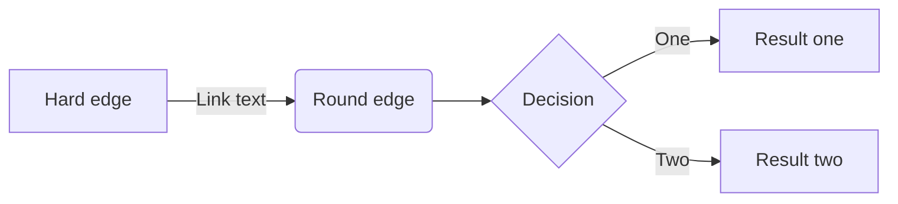

# Github Pages Blog

Dies ist das Quell-Repository für mein (statisches) Blog auf metawops.github.io.

## Kleiner Mermaid Test

```mermaid
flowchart LR
    A[Hard edge] -->|Link text| B(Round edge)
    B --> C{Decision}
    C -->|One| D[Result one]
    C -->|Two| E[Result two]
```