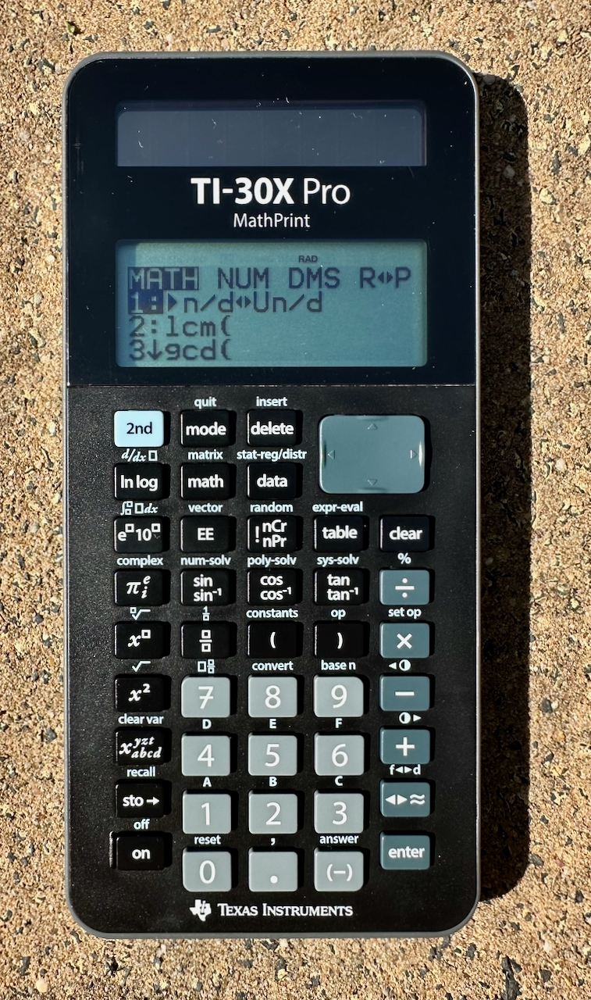

Der erste eigene Taschenrechner, den ich in der Schule (Mittelstufe) benutzte, war ein TI-30 von Texas Instruments. Damals noch mit einem rot leuchtenden LED Display. Leider ist der mittlerweile verschütt gegangen, so dass ich kein Foto von ihm machen kann. Aber dankenswerterweise hat mir Jörg Falken zwei sehr schöne Fotos zur Verfügung gestellt. 

Da wäre zunächst mal das allererste Modell von 1976:

*TI-30 von 1976: Das erste Modell. Foto: Jörg Falken*

Jörg restauriert alte Taschenrechner ganz hervorragend, mit viel Liebe zum Detail und [verkauft so manchen auf der Kleinanzeigen Plattform][joerg].

Dieses schöne erste TI-30 Modell hatte ich vermutlich nicht, denn 1976 war ich noch in der Grundschule.

## Evolution
Aber Texas Instruments hat die "Marke" TI-30 über die Jahre immer wieder neu erfunden. Das folgende Foto zeigt vier Versionen dieses erfolgreichen Taschenrechners und auch die erste LCD Version von 1983 hatte ich als offiziellen Schul-Taschenrechner in Benutzung.

*Vier Modellvarianten des TI-30. Foto: Jörg Falken*

## Erinnerungen
In meiner Erinnerung fand ich den LED TI-30 zwar sehr interessant und hab ihn auch damals schon versucht, auseinander zu nehmen. was dazu führte, dass das dünne Front-Blech bald verbogen und verkratzt war.  
Aber schon bald fand ich den Funktionsumfang etwas langweilig und beschränkt. Der Taschenrechner von meinem Vater, ein SR-56, sah viel imposanter aus. Und erst der TI-59 von meinem Bruder!

Leider war auch der TI-30 LCD da keine Steigerung. Im Gegenteil: Seine Tasten funktionierten oft nicht zuverlässig genug und so fand ich schnell alles, was mit "TI-30" beschriftet ist, doof.

## Entwicklungen
Doch warum heute, Jahrzehnte später ein Artikel über den TI-30? Im Laufe der vielen Jahre habe ich viele Taschenrechner in den Händen gehalten und so manche gesucht und gesammelt, sowohl von Texas Instruments, vor allem aber auch solche von Hewlett Packard und den ein oder anderen von Casio. Garniert mit ein paar Sharps oder auch z.B. dem Numworks.  
Dabei haben mich meist die Spitzenmodelle interessiert. Programmierbar sollten sie möglichst sein. Dass diese heutzutage in Prüfungen meist nicht zugelassen sind, interessierte mich ja nicht mehr.  
Doch nun bin ich selbst demnächst wieder mal Prüfling – Amateurfunk verspricht ein interessantes Hobby zu werden – und benötige einen nicht-programmierbaren Taschenrechner. Ein Blick in den Fundus zeigte rasch: OHA! Wenig bis keine Auswahl!

## Heute
Den ein oder anderen Casio fand ich, v.a. der fx-991DE X ist da wohl weit vorn.  
Aber natürlich wollte ich mal wissen, was denn so ein Platzhirsch beim Thema Taschenrechner, wie es eben Texas Instruments immer noch ist, im Angebot hat.  
Und siehe da: Die Marke "TI-30" gibt es *immer noch*. Und so bestellte ich mir den aktuell[^1] besten, den "TI-30X Pro MathPrint".

*TI-30X Pro MathPrint. Foto: Stefan Wolfrum*

Alter Schwede! Da hat sich ja einiges getan!  
Vor allem bin ich erstaunt, wie viel mehr Funktionalität ein Schul-Taschenrechner heutzutage an Board hat. Da fehlt ja wirklich (fast) nichts mehr an Features, Respekt! Eigentlich braucht der normale Mensch, der doch hin und wieder etwas im Alltag zu rechnen hat, nicht mehr als was so ein Rechner bietet.

## Wünsche
Leider ist der TI30X Pro dennoch nicht 100%ig perfekt.  
Wirklich enttäuscht war ich von der Tatsache, dass ihm die Möglichkeit fehlt, den Exponenten in der *10^x Schreibweise einer Zahl in 3er Schritten "durchzusteppen". 

## Smartphones & die Zukunft
Natürlich ...
Aber: Smartphones sind eben weder in der Schule, noch bei anderen Prüfungen erlaubt. Die Daseinsberechtigung für Taschenrechner bleibt bestehen und ich bin gespannt, was sich auf dem Sektor in Zukunft noch tun wird! Gibt es da noch Innovationsmöglichkeiten? Welche Firmen werden sich weiterhin leisten, auf dem Sektor zu investieren?

[joerg]: https://www.kleinanzeigen.de/s-bestandsliste.html?userId=21389723

[^1]: Zum Zeitpunkt des Schreibens dieses Blog Posts: Juni 2025