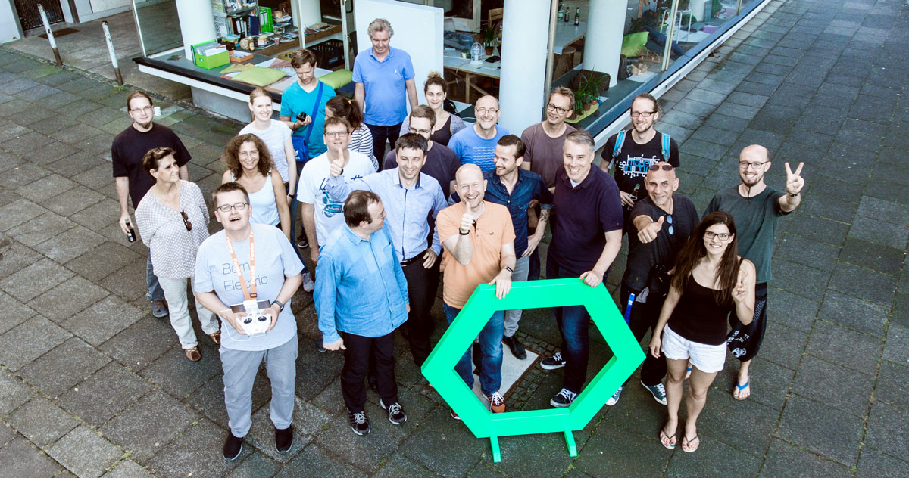
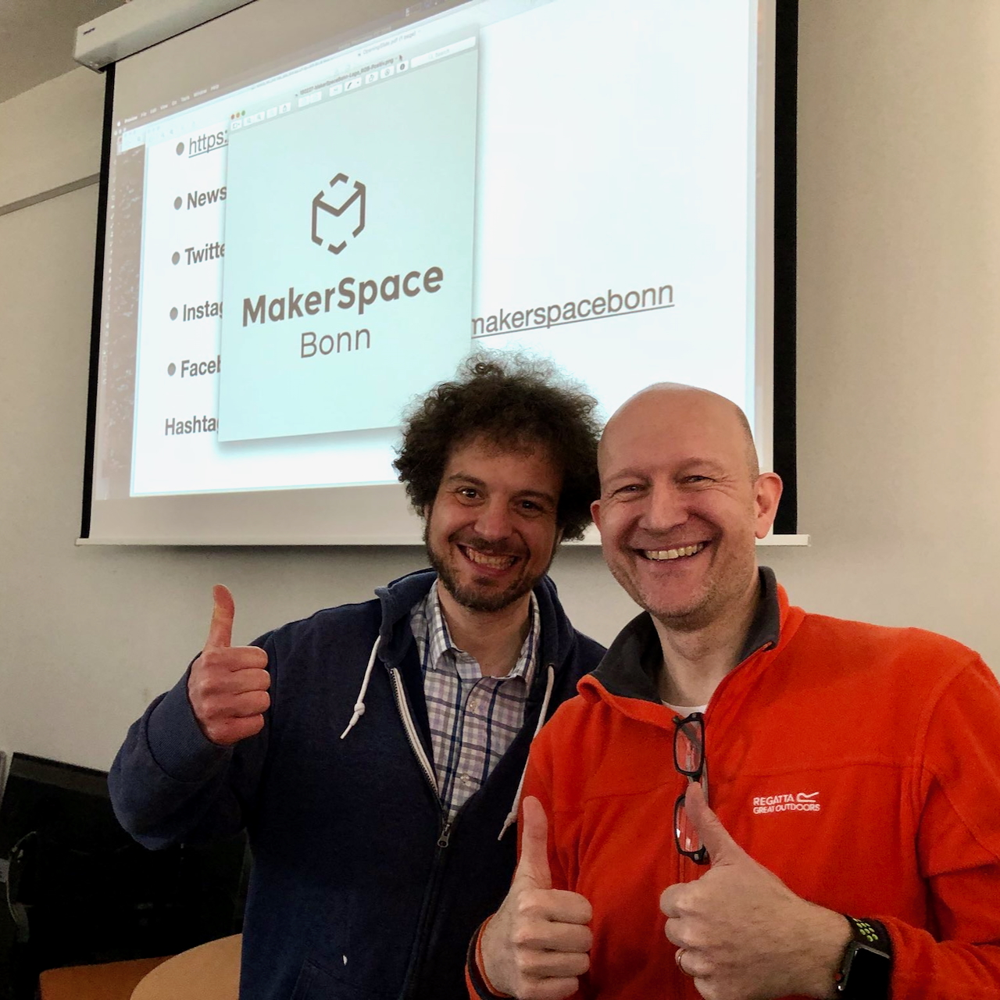

{: .align-right style="margin-top: -2em; max-width: 300px;"}

### Dr. Böhm
Alles fing vermutlich damit an, dass mein Papa in den 70er/80er Jahren zwei [Dr. Böhm Orgeln][drboehm] selbst gebaut hat. Mit allem drum und dran, vor allem eben auch mit der Elektronik und dem Löten. Der "Duft" des [Kolophoniums][kolophonium] ist mir seitdem nie mehr aus der Nase gegangen. (Witzig, dass ich den selben Stoff später auf den Cellobogen schmierte ...)

### Busch Elektronik
Da ich offenbar Interesse an diesen Hobby-Tätigkeiten meines Vaters zeigte, war es sicher nicht verwunderlich, dass ich dann mit Elektronikbaukästen der [Firma Busch][busch] (teilweise in Kooperation mit der Fachzeitschrift ELO) beschenkt wurde. Eines Weihnachtens ging sogar der Traum des sehnsüchtig erwarteten "[Microtronic 2090][micro2090]" Kastens in Erfüllung und so lernte ich Programmieren in [hexadezimal][hex].

### C64
Es kam, wie es kommen musste: Wenig später schwamm ich voll in der Heimcomputer Szene der 80er mit und beackerte unseren Commodore 64 inkl. Diskettenlaufwerk und Vierfarb-Plotter. Das Abtippen langer Listings aus der [Happy Computer][happy] oder dem [64er Magazin][64er] gehörte dazu. Aber dem Data Becker Verlag und seinem Standardwerk "[64 intern][64intern]" inkl. kommentiertem ROM Listing ist es zu verdanken, dass ich tiefer einstieg. Doch selbst [Apfelmännchen][apfel] in Assembler bei 160x200 Pixel in 4 Farben dauerten vielen Stunden, der C64 lief über Nacht heiß.

### PC Ära
Genau wie der folgende PC von [Zenith][zenith]. 8086 Prozessor, 640 KB RAM, zwei Floppy-Laufwerke, CGA Grafik, 4.7 MHz, auf 8 MHz umschaltbar. [Turbo Pascal][pas] von Borland. Apfelmännchen immer noch zu langsam. Mein Vater spendierte den [8087 Coprozessor][8087], das brachte ordentlich Schub – für damalige Verhältnisse. Später kam die obligatorische Festplatte mit sagenhaften 40 MB ("wird ja nie voll!") dazu.

### Apple
Fast Forward, nach diversen immer besseren PCs lernte ich in den 2000er Jahren [Kai Krause][kai] kennen. Natürlich waren die alle auf Macs unterwegs. Für mich bisher immer unerschwinglich. Aber wenn man (damals) _einmal_ gesehen hat, wie genial das alles läuft und wie hakelig dagegen Windows war ... Ich hatte angebissen und besaß bald meinen ersten Mac, ein weißes [iBook mit G3 Prozessor][ibook].

Dem folgten bis heute zahlreiche weitere Rechner der Apfelmarke. Ich bin im Apple Universum unterwegs und sehr happy damit. – Was nicht heißt, dass ich alles andere verteufle! Kann ja jeder machen, wie er/sie mag. Ich werkel auch viel und gern mit [Raspberry Pi][raspi]s mit Linux-Derivaten. Und für Notfälle (wie z.B. [MS Power BI][pbi]) läuft auf meinem [Proxmox][prox] [Serverchen][nipogi-minipc] ein virtuelles Windows. 🤷‍♂️

### Taschenrechner
Woher _das_ kommt, kann ich nicht sagen, aber ich habe ein Faible für Taschenrechner. Mein Papa hatte einen [Texas Instruments SR-56][sr56] (den ich heute besitze und der immer noch prima läuft nach dem Umbau auf LiIon Akku) und mein Bruder einen [TI-59][ti59] (Magnetkarten – wow) inklusive [Drucker PC-100C][pc100c].

In der Schule begann es für mich mit dem obligatorischen [TI-30][ti30] (das Modell mit LED Display), aber in der Oberstufe schwenkte ich auf Casio mit meinem heiß geliebten [fx-602p][602p]. Der wurde natürlich gehackt, denn da gab es einige Schlupflöcher in der Firmware, ich erinnere mich an Zeichen im modernen LCD Punktmatrix Display, die von Casio nicht vorgesehen waren ...

Später gehörte ich zu den stolzen Besitzern des weltweit ersten Grafik-Taschenrechner Modells [fx-7000G][7000g] – die skeptischen Blicke und das irritierte "Hm" meines lieben Mathe LK Lehrers Dr. Treiber werde ich nie vergessen.

### HP
Nachdem ich früher immer HPs "komisches" UPN Eingabesystem abgelehnt hatte, lachte mich der 1990 eingeführte HP48SX dann doch irgendwie an und ich entschloss mich, diese unbekannte Welt mal zu erforschen. Schnell war ich begeistert, es folgte der HP48GX, den ich _noch_ ein wenig mehr liebte und der mich lange im Studium begleitete. Ich lernte neben der vorgesehenen Sprache UserRPL dann auch SysRPL und Assembler und werde nie vergessen, wie ich in den Niederlanden bei einer HP Taschenrechner Konferenz sowohl den legendären Wlodek Mier-Jedrzejowicz, als auch die HP48G/GX Projektleiterin Diana Byrne persönlich kennenlernen durfte.
Es wuchs eine Begeisterung und Ehrfurcht vor der (frühen; prä-[Fiorina][carly]) Firma HP und deren Gründer Bill Hewlett und Dave Packard. Ich begann nicht nur, einige Ausgaben des HP Journals zu sammeln, sondern auch allerlei HP Taschenrechner. Mein Traum war immer, einen HP-85 Computer zu besitzen, seit ich den zu Schulzeiten bei einem Mitschüler zuhause einige Male gesehen und programmiert habe. Der Traum wurde vor wenigen Jahren wahr, als ich einen sehr gut erhaltenen HP-85A zu einem sehr fairen Preis erstehen konnte. 🤩

## Bonn
### OK Lab / Code for Bonn
Beim ersten Bonner BarCamp 2015 trat ich mit Sven Hense von der Stadt Bonn auf die "Bühne" und schlug die Gründung des "OK Lab Bonn" vor. OK steht hier für _Open Knowledge_ und diese OK Labs, die es in mehreren Städten gibt, sind eine Initiative der [Open Knowledge Foundation][okf], die weltweit agiert. Kurz darauf wurde das OK Lab Bonn gegründet, in dem vor allem die "[Code for Germany][cfg]" Aktion im Fokus stand.

_Foto: Micky Roth_

Später wurde daraus das [OK Lab Bonn Rhein Sieg][oklab-brs].

### MakerSpace
In Bonn gab es das schöne "Elektronikbasteln" Treffen, das Salim Deeb ins Leben gerufen hatte. Dort war ich einige Male und es gab immer einen tollen Austausch mit Gleichgesinnten, die etwas gebastelt hatten und es vorstellten. Hier konnte man auch alle Fragen stellen, bekam Antworten und lernte viel.
Doch Salim und ich träumten von einem richtigen, dedizierten Raum, einem Ort, der immer offen hat, wo man hingehen und basteln kann, wo es Geräte gibt, die man selbst nicht hat, wo Erfahrungen und Wissen getauscht werden, wo jeder seine Bastel-Projekte voranbringen und Gleichgesinnte finden kann. _Ein MakerSpace!_ 🤩
Wir beide haben die Idee über Jahre vorangetrieben, als Rechtsform einen Verein gegründet und nach längerer Suche sogar Räumlichkeiten gefunden. Am 3. März 2018 war feierliche Eröffnung des ersten [MakerSpace Bonn][msb]!

_Foto: Philipp Schindera_

Auf den Seiten eines unserer Sponsoren, dem O'Reilly/dpunkt Verlag, gibt es auch noch [ein Interview dazu][interview].

🔲
{: style="text-align: right" }

[602p]: https://en.wikipedia.org/wiki/Casio_FX-602P_series
[64er]: https://de.wikipedia.org/wiki/64’er
[64intern]: https://www.c64-wiki.de/wiki/64_intern
[7000g]: https://en.wikipedia.org/wiki/Casio_fx-7000G
[8087]: https://de.wikipedia.org/wiki/Intel_8087
[apfel]: https://de.wikipedia.org/wiki/Mandelbrot-Menge
[busch]: https://de.wikipedia.org/wiki/Busch_(Modellbahnzubehör)
[carly]: https://de.wikipedia.org/wiki/Carly_Fiorina
[cfg]: https://codefor.de
[drboehm]: https://de.wikipedia.org/wiki/Dr.-Böhm-Orgel
[happy]: https://de.wikipedia.org/wiki/Happy_Computer
[hex]: https://de.wikipedia.org/wiki/Hexadezimalsystem
[ibook]: https://de.wikipedia.org/wiki/IBook#iBook_Dual_USB
[interview]: https://dpunkt.de/einfach-mal-machen-makerspace-bonn/
[kai]: https://de.wikipedia.org/wiki/Kai_Krause
[kolophonium]: https://de.wikipedia.org/wiki/Kolophonium
[micro2090]: https://www.busch-modell.de/information/Microtronic-Computer.aspx
[msb]: https://makerspacebonn.de
[nipogi-minipc]: https://amzn.to/4mXEfQb
[okf]: https://okfn.org/en/
[oklab-brs]: https://codeforbonnrheinsieg.de/
[pas]: https://de.wikipedia.org/wiki/Turbo_Pascal
[pbi]: https://www.microsoft.com/de-de/power-platform/products/power-bi?market=de
[pc100c]: http://www.datamath.org/Sci/WEDGE/PC-100C.htm
[prox]: https://www.proxmox.com/de/produkte/proxmox-virtual-environment/uebersicht
[raspi]: https://www.raspberrypi.com
[sr56]: http://www.datamath.org/SCI/WEDGE/SR-56.htm
[ti30]: http://www.datamath.org/SCI/MAJESTIC/TI-30.htm
[ti59]: http://www.datamath.org/SCI/WEDGE/TI-59.htm
[zenith]: https://de.wikipedia.org/wiki/Zenith_Electronics_Corporation
