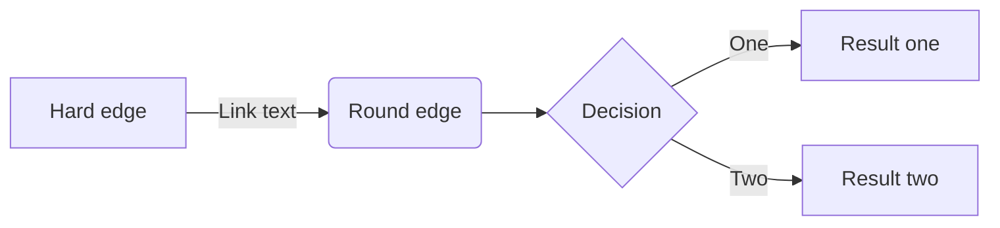

Aha. Wieder was gelernt! Es gibt eine Syntax-Definition, mit der man z.B. auch in Markdown Dokumenten Diagramme aller Art erzeugen kann. Natürlich nur, wenn der zum Einsatz kommende Markdown Prozessor auch [Mermaid](https://mermaid.js.org) unterstützt.

## Kleiner Mermaid Test

