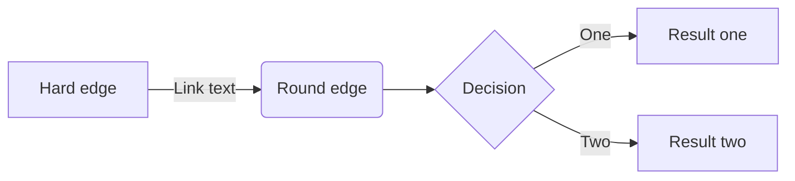

Aha. Wieder was gelernt! Es gibt eine Syntax-Definition, mit der man z.B. auch in Markdown Dokumenten Diagramme aller Art erzeugen kann. Natürlich nur, wenn der zum Einsatz kommende Markdown Prozessor auch [Mermaid](https://mermaid.js.org) unterstützt.

## Kleiner Mermaid Test

Der folgende Code im Artikel-Markdown ...

````

````

... erzeugt dann dieses Diagramm:


Wie man Mermaid in seine Github Pages einbindet, damit dann eben auch das Rendern so einer Diagramm-Beschreibung klappt, habe ich [in diesem Blog Post beschrieben](https://metawops.github.io/github%20pages/Mermaid-einbinden/).

🔲
{: style="text-align: right" }