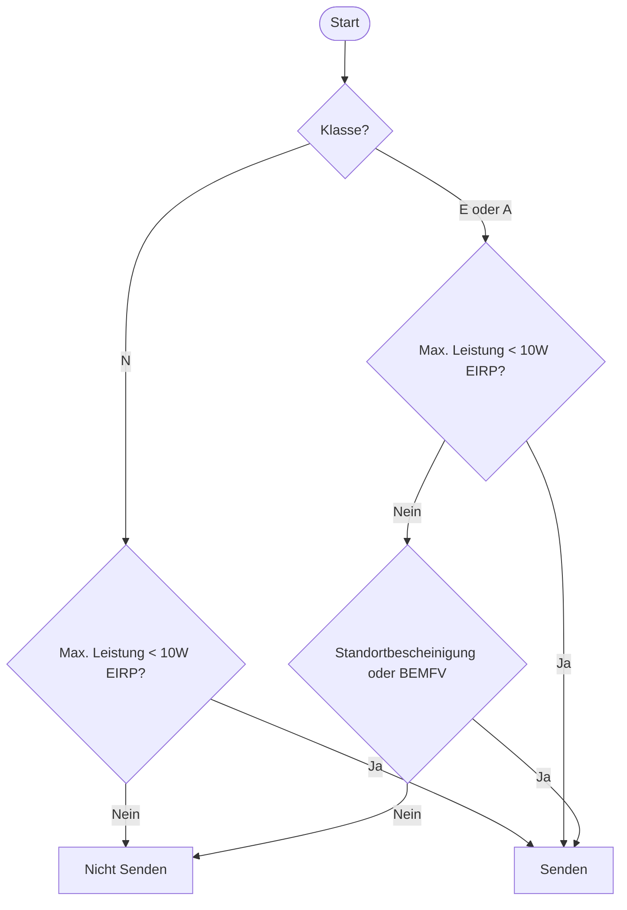

Hier mal ein Anwendungsfall für [Mermaid][tag-mermaid].

Es geht um die Frage, ob ich senden oder nicht senden darf, in Abhängigkeit meiner Amateurfunklizenz und meiner Sendeleistung.


Die Diagramm-Idee stammt aus dem [N-Lizenz-Lehrgang-Video, Lektion 8, "Antennen und Leitungen"][video]. – Dort sieht es auch hübscher und übersichtlicher aus ...

Na, vielleicht lerne ich noch mehr über die Mermaid-Sprache in nächster Zeit und kann das Diagramm oben noch optimieren.

Oder ihr habt einen Tipp, wie man das Diagramm weniger "wild" gestalten kann? Aktuell sieht der Mermaid Code zu obigem Diagramm so aus:

````

````

Bin für sachdienliche Hinweise offen! 

🔲
{: style="text-align: right" }

[video]: https://youtu.be/Oe2XpzhSVEQ?si=K3jzmHP7x92_RXBa&t=2683
[tag-mermaid]: https://blog.metawops.de/tags/#mermaid